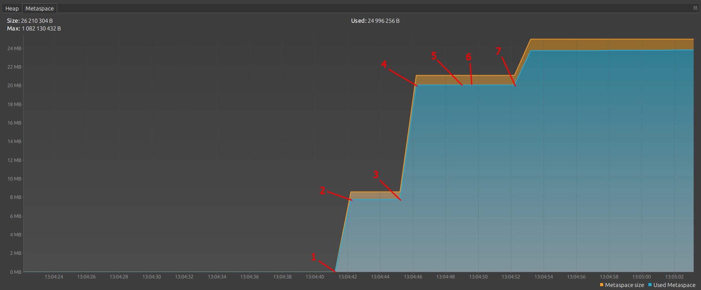
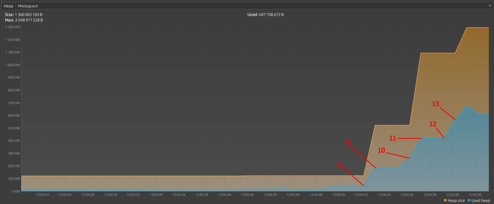
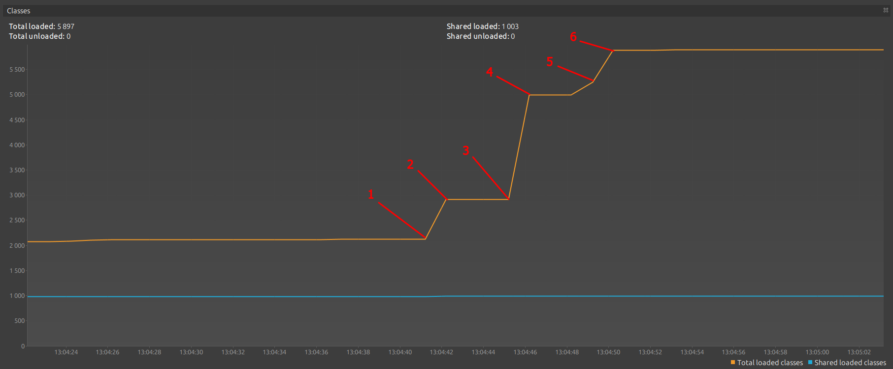

# Задача "Понимание JVM"
## Код для исследования
    public class JvmComprehension {

        public static void main(String[] args) {
            int i = 1;                      // 1
            Object o = new Object();        // 2
            Integer ii = 2;                 // 3
            printAll(o, i, ii);             // 4
            System.out.println("finished"); // 7
        }

        private static void printAll(Object o, int i, Integer ii) {
            Integer uselessVar = 700;                   // 5
            System.out.println(o.toString() + i + ii);  // 6
        }
    }
## Анализ кода
1. **Application Classloader** загружает в **Metaspace** класс **JvmComprehension**.
2. **Bootstrap ClassLoader** загружает в **Metaspace** классы **Object**, **Integer**, **String**, **System** и др.
3. В **Stack memory** создается frame **main()**
4. Внутри frame **main()** создается переменная i типа int и ей присваивается значение 1.
5. В **Heap** выделяется место по объект типа Object, после это конструктор инициализирует объект Object в **Heap**, во frame **main()** создается переменная o типа Object, в которую помещается ссылка на объекты Object из **Heap**.
6. В **Heap** выделяется место по объект типа Integer, после это конструктор инициализирует объект Integer в **Heap** значением 2, во frame **main()** создается переменная ii типа Integer, в которую помещается ссылка на объекты Integer из **Heap**.
7. В **Stack memory** создается frame **printAll()**, в который передаются ссылки на объекты Object и Integer из **Heap**, хранящиеся соответственно в переменных o и ii, и значение переменной i.
8. В **Heap** выделяется место по объект типа Integer, после это конструктор инициализирует объект Integer в **Heap** значением 700, во frame **maiprintAlln()** создается переменная uselessVar типа Integer, в которую помещается ссылка на объекты Integer из **Heap**.
9. В **Stack memory** создается frame **out.println()**, в который передаются ссылки на объекты Object и Integer из **Heap**, хранящиеся соответственно в переменных o и ii, и значение переменной i.
10. В **Stack memory** создается frame для конкатенации строковых значений, в который передаются ссылки на объекты Object и Integer из **Heap**, хранящиеся соответственно в переменных o и ii, и значение переменной i.
11. В **Stack memory** создается frame **toString()**, в который передается ссылка на объект Object, хранящийся в переменной o.
12. По завершению всех операций во frame **toString()**, мы возвращаемся во frame для конкатенации строковых значений. При этом frame **toString()** удаляется из **Stack memory**.
13. Последовательно выполняя все операции во frames конкатенация строковых значений, **out.println()** и **printAll()**, мы возвращаемся во frame **main()**. При этом frames конкатенация строковых значений, **out.println()** и **printAll()** удаляются из стека в порядке, обратном их созданию (**FILO**).
14. По возвращению в frame **main()** в **Heap** выделяется место под объект типа String, который после этого инициализируется конструктором значением "finished", и ссылка на созданный объект передается во вновь созданный frame **out.println()**.
15. По завершению всех операций во frame **out.println()**, мы возвращаемся во frame **main()** и frame **out.println()** удаляется из **Stack memory**.
16. После этого программа завершается и frame **main()** также удаляется из ***Stack memory**.
17. Помимо это в течении всего жизненого цикла программы переодически запускается **Garbage Collection**, который анализирует все объекты созданные в **Heap**, на возможность их удаления из **Heap**.
# Задача "Исследование JVM через VisualVM"
## Точки программы (легенда)
1. 13:04:41.689251: loading io.vertx
2. 13:04:42.170896: loaded 529 classes
3. 13:04:45.177389: loading io.netty
4. 13:04:46.118735: loaded 2117 classes
5. 13:04:49.119021: loading org.springframework
6. 13:04:49.498526: loaded 869 classes
7. 13:04:52.498893: now see heap
8. 13:04:52.499899: creating 5000000 objects
9. 13:04:52.963969: created
10. 13:04:55.964765: creating 5000000 objects
11. 13:04:56.575636: created
12. 13:04:59.724628: creating 5000000 objects
13. 13:05:00.425310: created
## Metaspace

## Heap

## Classes
